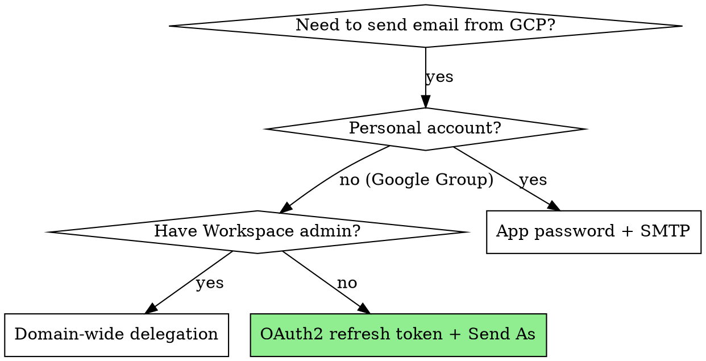

# Gmail "Send As" for Google Groups on GCP

## Overview

Send email as a Google Group address (e.g. `community@company.com`) from a GCP backend using the Gmail API with an OAuth2 refresh token. The authenticated user must have "Send As" configured in their Gmail settings for the group address.

## When to Use

- Backend needs to send automated emails from a shared/group address
- You're on GCP (App Engine, Cloud Run, Cloud Functions)
- The group address is a Google Group, not a personal account (no password, no app password)
- You or a team member has "Send As" permission for the group in Gmail

**Don't use when:** You have a personal Gmail account (use app password + SMTP instead), or you have Workspace admin access (domain-wide delegation is cleaner).

## Decision Tree



## Setup (One-Time)

### 1. Enable Gmail API
```bash
gcloud services enable gmail.googleapis.com --project=YOUR_PROJECT
```

### 2. Get OAuth2 refresh token with Gmail scope
```bash
gcloud auth application-default login \
  --scopes=https://www.googleapis.com/auth/gmail.send,https://www.googleapis.com/auth/cloud-platform
```
This opens a browser. Sign in as the user who has "Send As" for the group.

### 3. Extract credentials
```python
import json
with open('~/.config/gcloud/application_default_credentials.json') as f:
    creds = json.load(f)
# You need: client_id, client_secret, refresh_token
```

### 4. Store in environment (app.yaml for App Engine)
```yaml
env_variables:
  GMAIL_SEND_AS: "group@company.com"
  GMAIL_CLIENT_ID: "764086051850-..."
  GMAIL_CLIENT_SECRET: "d-FL95Q..."
  GMAIL_REFRESH_TOKEN: "1//03PGE..."
```

## Implementation

```python
def send_email(to_emails, subject, html_body, attachment_bytes=None, attachment_name=None):
    """Send via Gmail API with OAuth2 refresh token as a Google Group address."""
    import base64
    from email.mime.multipart import MIMEMultipart
    from email.mime.text import MIMEText
    from email.mime.base import MIMEBase
    from email import encoders
    from google.oauth2.credentials import Credentials
    from googleapiclient.discovery import build

    creds = Credentials(
        token=None,
        refresh_token=os.environ['GMAIL_REFRESH_TOKEN'],
        client_id=os.environ['GMAIL_CLIENT_ID'],
        client_secret=os.environ['GMAIL_CLIENT_SECRET'],
        token_uri='https://oauth2.googleapis.com/token',
        scopes=['https://www.googleapis.com/auth/gmail.send']
    )
    creds = creds.with_quota_project('YOUR_PROJECT_ID')  # REQUIRED on App Engine
    service = build('gmail', 'v1', credentials=creds, cache_discovery=False)

    msg = MIMEMultipart()
    msg['From'] = os.environ['GMAIL_SEND_AS']  # Group address
    msg['To'] = ', '.join(to_emails)
    msg['Subject'] = subject
    msg.attach(MIMEText(html_body, 'html'))

    if attachment_bytes and attachment_name:
        part = MIMEBase('application', 'octet-stream')
        part.set_payload(attachment_bytes)
        encoders.encode_base64(part)
        part.add_header('Content-Disposition', f'attachment; filename="{attachment_name}"')
        msg.attach(part)

    raw = base64.urlsafe_b64encode(msg.as_bytes()).decode()
    service.users().messages().send(userId='me', body={'raw': raw}).execute()
```

## Common Mistakes

| Mistake | Fix |
|---------|-----|
| Missing `with_quota_project()` | App Engine returns 403 "requires a quota project". Always set it. |
| Using `with_subject()` for delegation | That's for service account DWD, not user credentials. Use `Credentials()` directly. |
| Forgetting `cache_discovery=False` | Causes filesystem errors on read-only App Engine. |
| `userId='me'` confusion | `'me'` means the authenticated user (refresh token owner), not the From address. |
| SendGrid as first choice | Requires new account, API key, sender verification. Gmail API is zero-cost if you're already on GCP + Workspace. |
| Trying domain-wide delegation without admin | DWD requires a Workspace admin to authorize the service account client ID in the Admin Console. If you don't have admin access, use OAuth2 refresh token. |

## Dependencies

```
google-api-python-client>=2.0.0
google-auth>=2.0.0
```
